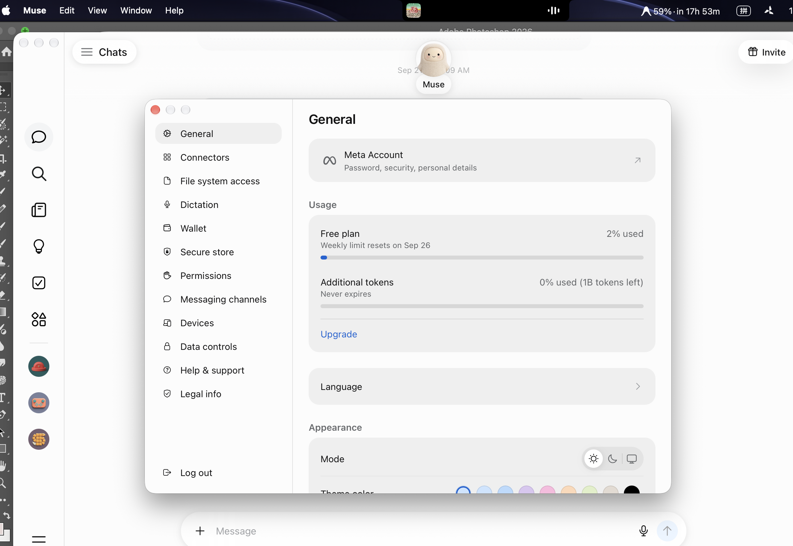
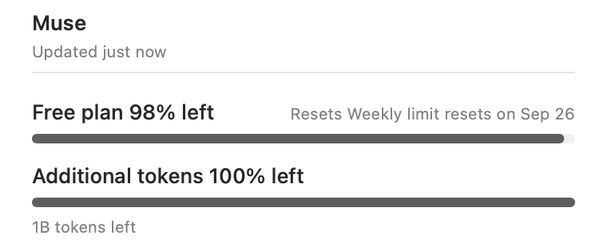

# Muse desktop

CodexBar can show the usage displayed by the Muse desktop app when its **Settings → General → Usage** section is visible. This is separate from the existing Muse Code provider, which uses the Muse CLI and its subscription API.

## Setup

1. Open Muse and open **Muse → Settings**.
2. Leave the **General → Usage** section visible.
3. In macOS **System Settings → Privacy & Security → Accessibility**, add CodexBar and enable it.
4. Enable **Muse** in CodexBar's provider settings, then refresh.

The provider reads the visible Accessibility tree only. It does not read Muse credentials, Keychain items, chat content, or private API responses. The Usage section must remain open when CodexBar refreshes.

## Data shown

- **Free plan** weekly percentage and the displayed reset date.
- **Additional tokens** percentage and the displayed remaining-token description.

## Runtime evidence

The redacted source capture below was supplied from Muse's Settings → General → Usage page and shows the values that CodexBar reads. The reader uses only the visible Accessibility tree; no account identifier or credential is included.

The rebuilt CodexBar card render below is a native AppKit render of the same card path used by the menu. It verifies that the timestamp-free `1B tokens left` value is rendered as balance detail, without a misleading reset prefix. The older local smoke capture is retained as `screenshots/muse-app-usage.png` for provider-selection context; it predates this presentation fix.

Muse can change its settings UI text or accessibility structure. If the provider becomes unavailable after a Muse update, the UI parser may need to be adjusted.
